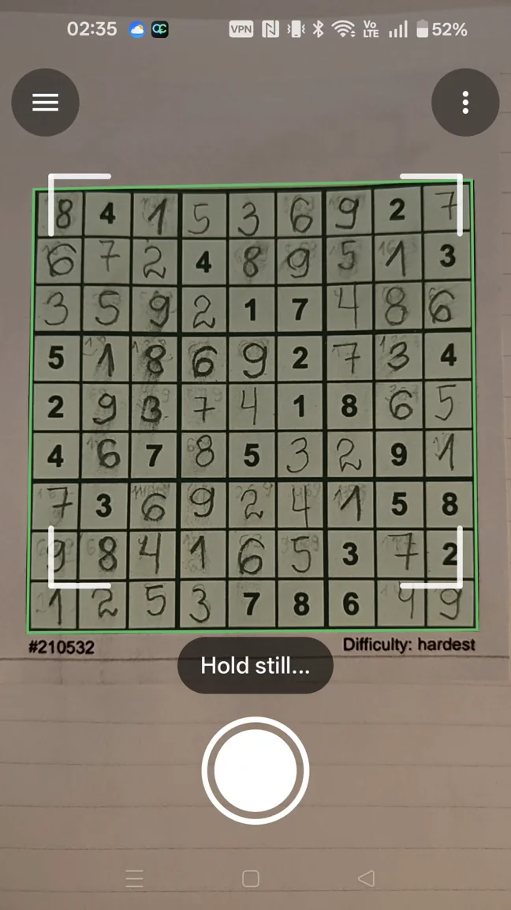
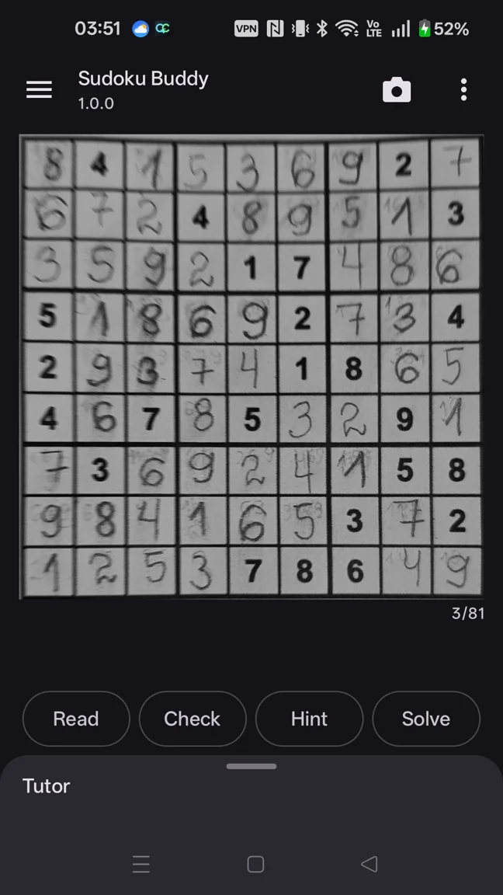
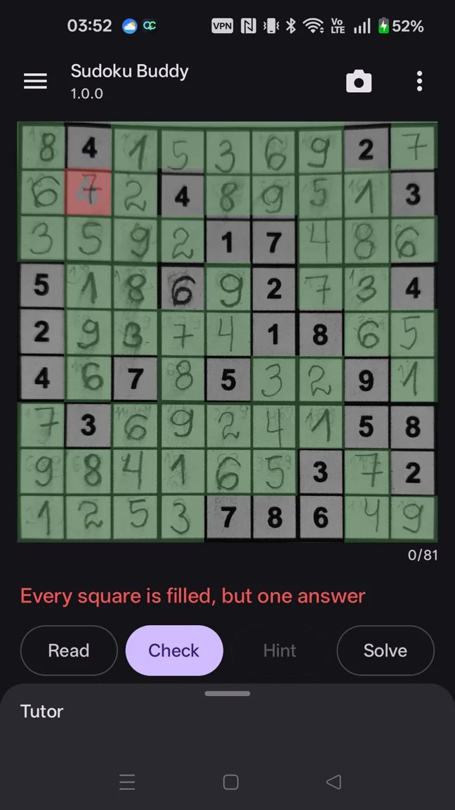
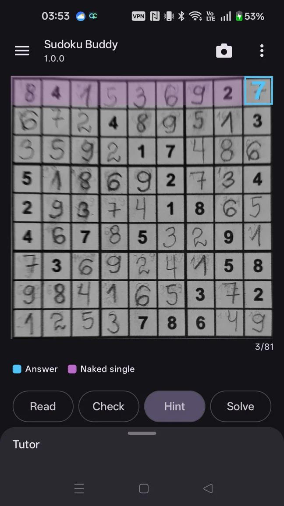
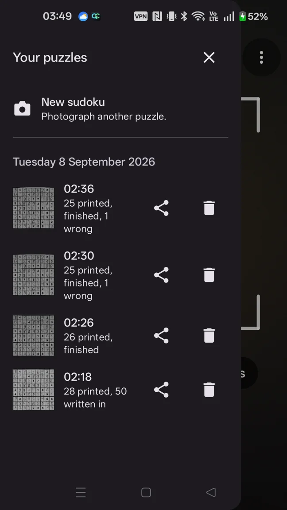

<p align="center">
  
</p>

# Sudoku Buddy

**The joy is in figuring it out.**

Keep your pencil. Keep your puzzle. Get a little help when you need it.

Sudoku Buddy is an Android camera companion for people who enjoy solving **standard
9×9 Sudoku on paper**. It reads the puzzle in front of you, including handwritten
progress, checks your answers and helps you understand the next move. Bring a puzzle
from a newspaper, book or magazine—even one you have already started.

**[Explore the website](https://freevia.org/sudoku-buddy/)** ·
**[How to use it](docs/user-guide.md)** ·
**[Privacy](https://freevia.org/sudoku-buddy/privacy)** ·
**[Support](.github/SUPPORT.md)**

## Availability

Sudoku Buddy is being prepared for its **first Google Play release**. It will be free
for Android phones running **Android 8.0 or later**, with a camera. The Play download
link will be added here when the app is available. Development and final release testing
are ongoing; this repository does not announce a production release.

## A nudge. A check. A fresh perspective.

- **Read your progress.** Scan printed clues and the answers you have written on the page.
- **Confirm the reading.** Review recognized digits and correct individual squares before continuing.
- **Check your work.** See which handwritten answers are correct and which need another look.
- **Understand a deduction.** Hints name the solving technique and highlight the relevant cells.
- **Choose your level of help.** Reveal hints in stages, or view the solution when you want it.
- **Return after a break.** Reopen scanned puzzles and corrections from on-device history.

The purpose is to help with the puzzle already on your page. You choose when to ask for
help and when to put the phone down and carry on with your pencil.

## From paper to perspective

| 1. Point & scan | 2. Review & correct | 3. Check & understand |
| :---: | :---: | :---: |
|  |  |  |
| Frame the entire grid in even light and hold steady. | Check the digits against your page; tap a square to fix a misread. | Review your answers or ask for a hint, then continue on paper. |

Handwriting, crossings-out and difficult lighting can cause misreads. Review the recognized
grid before checking answers or relying on a hint. See the [usage guide](docs/user-guide.md)
for scanning tips and troubleshooting.

## Make the next move yours

A useful hint helps you see what you missed. Sudoku Buddy names the human solving
technique and highlights the cells behind the deduction. Reveal help a stage at a time,
so you can pause and think before seeing the answer.

| One deduction at a time | Pick up where you left off |
| :---: | :---: |
|  |  |
| Look at the relevant cells, follow the reasoning and try the move on paper. | Reopen a previous scan, continue your progress or delete it when you are done. |

These are real app screens from an existing development build. The interface may change
before the first release.

## On your phone. On your terms.

Recognition, checking and hints run on your device. Puzzle photographs, progress and
history stay in app-specific storage.

- Scanning, recognition, solving and tutoring work offline. Sending an uncertain-reading report requires an internet connection and the user's explicit submission, or the optional automatic-sharing setting.
- No account, ads, analytics or automatic crash reporting.
- Photo and diagnostics sharing through Android's share sheet remains user-directed. Puzzle
  reports can also be sent privately to Freevia from the reading screen; automatic sharing
  for uncertain readings is off by default and can be changed in Settings.

Diagnostics can include retained unsuccessful scans and a report with app/device
information. The current released build shares these through Android's share sheet when you
choose to send them. Direct private report submission is implemented in the release-preparation
branch but has not yet completed device qualification or been released. See the draft privacy
policy and release checklist.
Read the [privacy policy](https://freevia.org/sudoku-buddy/privacy) for storage, retention,
sharing and deletion details.

## For developers

The app uses Kotlin, Jetpack Compose and CameraX, with OpenCV for finding and straightening
the grid. Recognition and deterministic solving live in separate core modules.

| Module | Responsibility |
| --- | --- |
| `app` | Android camera, puzzle interface, tutor and local history |
| `core/model` | Grid, cells and puzzle state |
| `core/vision` | Grid detection, geometry and capture quality |
| `core/recognize` | Digit recognition and clue/handwriting interpretation |
| `core/solver` | Sudoku solving and human technique deductions |
| `tools/recognizer` | Recognition training and evaluation tools |

Use an Android SDK with platform 36 and JDK 21. From the repository root:

```powershell
.\gradlew.bat build
.\gradlew.bat :app:assembleDebug
```

On macOS/Linux, use `./gradlew` instead. Debug builds use the separate package
`org.freevia.sudokubuddy.debug`; the release package is `org.freevia.sudokubuddy`.
Corpus photographs are not committed, so corpus-dependent tests may be skipped without
the local fixtures. A passing build alone does not qualify a release for Play.

Release signing and test distribution have separate setup:
[signing](docs/signing.md) · [Firebase distribution](docs/firebase-distribution.md).
Do not treat a locally built APK or an archived CI artifact as a Play-approved release.

## Feedback and support

For support, email [info@freevia.org](mailto:info@freevia.org).
For reproducible technical bugs or ideas, use [GitHub Issues](https://github.com/freevia-org/sudoku-buddy/issues).
Describe what you expected, what happened, the app version and your Android version.
Issue reports and attachments are public; use email when you want to share an example privately.

Published by **[Freevia](https://freevia.org/)**. Thoughtful software. More human possibility.
